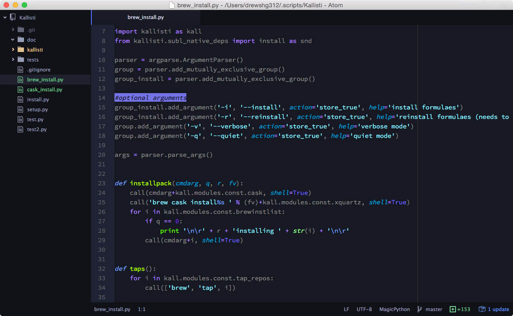

# atom-singing-stars syntax theme

[![MIT licensed][mit-badge]][mit-link]
[![Atom Theme][theme-badge]][theme-link]

My favourite high contrast hybrid color scheme for [Atom text editor][atom-link] ([On GitHub][atom-git]):

## Python

## Bash

## HTML

[atom-link]: https://atom.io/
[atom-git]: https://github.com/atom/atom
[mit-badge]: https://img.shields.io/badge/license-MIT-blue.svg
[mit-link]: https://raw.githubusercontent.com/drew-kun/atom-singing-stars/master/LICENSE
[theme-badge]: https://img.shields.io/badge/theme-atom--singing--stars-brightgreen.svg
[theme-link]: https://atom.io/themes/atom-singing-stars
